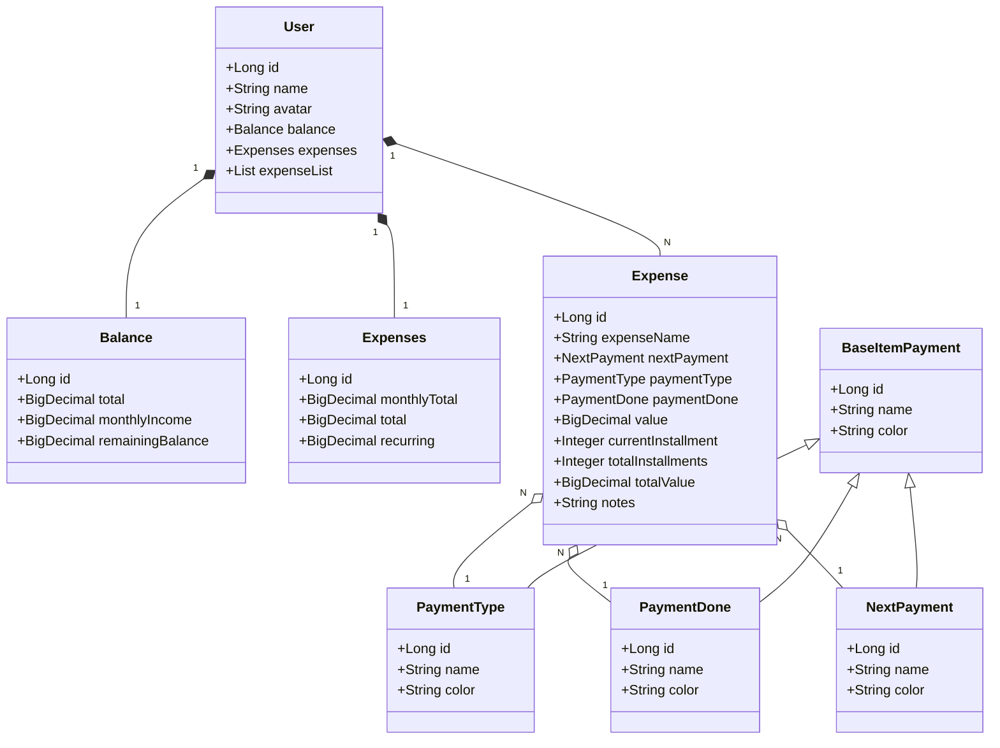

# Primeiro desafio da Decola Tech 2025 (DIO) - FinWise
Java RESTful API criada para o Decola Tech 2025

## Projeto no Figma

https://www.figma.com/design/TJFjDf94hdnrMJQy04KILr/Desafios-DIO-Decola-Tech-2025?node-id=0-1&t=TLCnHXOM3T30iAIL-1

## Diagrama de Classes

